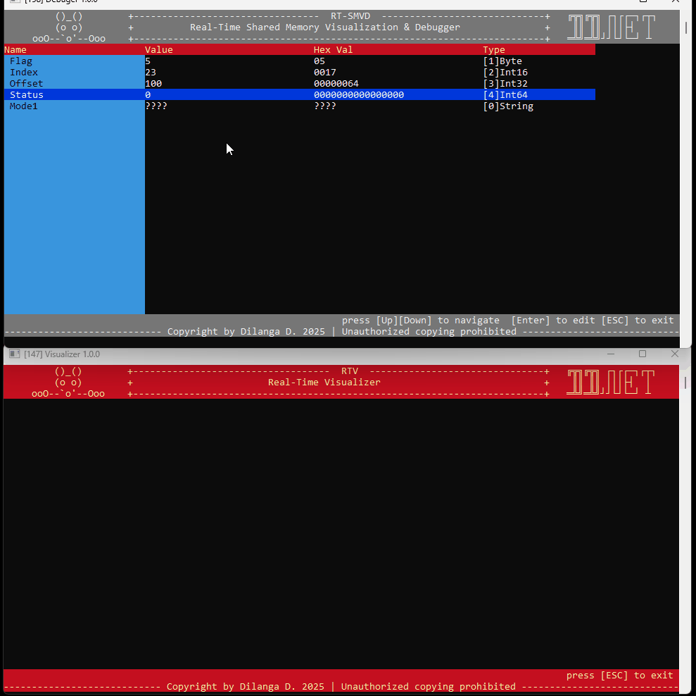
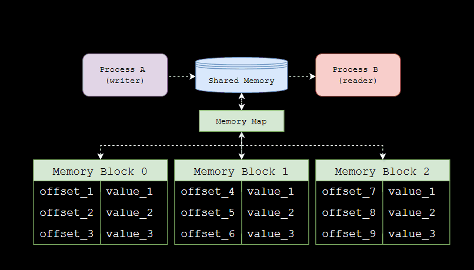
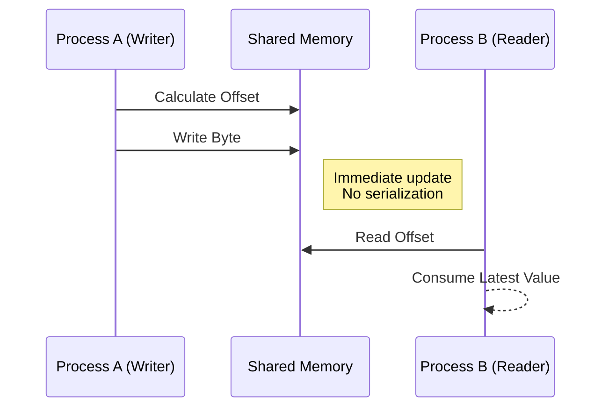

# .NET Shared Memory IPC Demonstration
  

>A minimal, industrial-style demonstration of **Inter-Process
>Communication (IPC)** using **memory-mapped files** in .NET.

>This project focuses on **architecture and technique**, showcasing how
>deterministic memory layouts enable **ultra-fast communication between
>processes** without relying on REST APIs, sockets, or message brokers.

------------------------------------------------------------------------

  
Traditional IPC methods introduce latency due to serialization and
networking layers.

Shared memory allows processes to communicate through **direct
byte-level access**, making it ideal for real-time and industrial
systems.

  Feature          Shared Memory   REST / TCP
  ---------------- --------------- ------------
  Latency          Extremely Low   Medium
  Serialization    None            Required
  Throughput       Very High       Moderate
  Determinism      High            Lower
  Industrial Fit   Excellent       Limited

> When milliseconds matter --- shared memory wins.

------------------------------------------------------------------------

  
Below is a simplified representation of how the shared memory is
organized.

    Memory Map (SYSMEM)
    Total Size: Fixed

    ┌──────────────────────────────────────┐
    │            MEMORY BLOCK 0            │
    ├──────────────────────────────────────┤
    │ Offset 0   → Value_1 (Byte)          │
    │ Offset 1   → Value_2 (Byte)          │
    │ Offset 2   → Value_3 (Byte)          │
    │ Offset 3   → Value_4 (Byte)          │
    │ Offset 4   → Value_5 (Byte)          │
    └──────────────────────────────────────┘

    ┌──────────────────────────────────────┐
    │            MEMORY BLOCK 1            │
    ├──────────────────────────────────────┤
    │ Offset 5   → Value_1                 │
    │ Offset 6   → Value_2                 │
    │ Offset 7   → Value_3                 │
    │ Offset 8   → Value_4                 │
    │ Offset 9   → Value_5                 │
    └──────────────────────────────────────┘

                    ...

    ┌──────────────────────────────────────┐
    │            MEMORY BLOCK N            │
    └──────────────────────────────────────┘

------------------------------------------------------------------------

  

------------------------------------------------------------------------

  

------------------------------------------------------------------------

  
### ✅ Structured Memory Modeling

Memory regions are mapped into logical structures that behave like
strongly-typed objects while still operating at the byte level.

**Benefits:** - Eliminates unsafe pointer usage\
- Maintains deterministic layout\
- Simplifies debugging\
- Production-friendly architecture

------------------------------------------------------------------------

### ✅ Offset-Driven Access

Instead of serialization:

✔ Data is written directly to known offsets\
✔ Readers retrieve the latest value instantly\
✔ No parsing overhead

**Address Formula:**

    Block Start = BlockIndex × BlockSize
    Field Address = BlockStart + FieldOffset

**Example:**

    BlockSize = 5 bytes
    Target = Block 2, Value_3

    Block Start = 2 × 5 = 10  
    Field Offset = 2  

    Final Address = 12

No lookup tables.\
No serialization.\
No parsing.

Just deterministic memory access.

------------------------------------------------------------------------

  
-   Designing deterministic memory layouts\
-   Modeling shared memory as structured data\
-   Offset-based read/write techniques\
-   Scalable block architecture\
-   High-performance IPC patterns

**Without exposing proprietary implementation details.**

------------------------------------------------------------------------

  
This design pattern mirrors communication layers used in:

-   Warehouse Control Systems (WCS)\
-   Rail Guided Vehicle (RGV) controllers\
-   Automated Storage & Retrieval Systems (ASRS)\
-   Robotics platforms\
-   Manufacturing execution systems

If you work in **industrial software**, this is a foundational
engineering concept.

------------------------------------------------------------------------

  
Production IPC systems must account for:

-   Memory collision prevention
-   Fixed structure sizes
-   Version compatibility
-   Synchronization strategy
-   Controlled write access

This demo follows a **structured layout strategy** to minimize
corruption risks and ensure predictable behavior.

------------------------------------------------------------------------

  
Engineers interested in:

-   Low-level programming
-   Systems engineering
-   Industrial automation
-   High-performance backend design
-   Memory-driven architectures

------------------------------------------------------------------------

  

> Shared memory is not just an IPC method ---\
> it is a **systems engineering mindset** focused on speed, determinism,
> and reliability.

------------------------------------------------------------------------

⭐ If you found this useful, consider starring the repository!
