# IMMERSIVE MARINE EXPLORATION – VR SUBMERSIBLE SIMULATION
 

>Immersive Marine Exploration is a high-fidelity virtual reality experience that transports users into the depths of the ocean through an interactive, presence-driven simulation. Designed for standalone VR with advanced hand tracking, the application removes traditional controller barriers and enables natural, gesture-based interaction. This approach strengthens embodiment within the virtual environment, allowing users to engage with the underwater world in a way that feels instinctive, responsive, and deeply immersive.

>At the center of the experience is a fully interactive submersible cockpit that serves as the operational hub for deep-sea navigation. Users interact directly with spatial controls — activating systems, monitoring instruments, and responding to changing underwater conditions — all through intuitive hand movements. By embedding the interface into the physical space rather than relying on abstract menus, the simulation reinforces realism and encourages learning through direct manipulation.

>The journey unfolds across diverse marine environments, ranging from calm, light-filled waters to darker zones where pressure and atmosphere intensify. Carefully crafted environmental details — volumetric lighting, suspended particles, spatial audio, and realistic color attenuation — establish a convincing sense of depth and scale. The ocean is presented not as a static setting but as a living ecosystem that invites exploration.

>Throughout the expedition, users encounter more than twenty-five marine species integrated with behavioral authenticity. Majestic whales glide through vast open water, schools of tuna shift dynamically in coordinated motion, and powerful predators such as sharks introduce moments of heightened awareness. Each encounter is designed to spark curiosity while reinforcing the grandeur and unpredictability of life beneath the surface.

>Interaction extends beyond observation. Users can engage with marine creatures to access contextual information, transforming the experience into an interactive learning platform. Education emerges organically through discovery, merging exploration with knowledge in a way that feels natural rather than instructional. This balance positions the simulation as both an immersive journey and a meaningful tool for marine awareness.

>Operational realism plays a critical role in sustaining engagement. Users must actively monitor life-support indicators such as oxygen levels, introducing a layer of responsibility that mirrors real-world submersible missions. Dynamic events further enhance immersion — including environmental stress and unexpected predator encounters that can visibly impact the vehicle. These moments create controlled tension, elevating emotional involvement while maintaining user comfort.

>Visually, the experience prioritizes atmospheric coherence and spatial fidelity. Gradual shifts in color replicate the behavior of light at increasing depths, while refracted patterns and distant silhouettes emphasize the ocean’s vastness. Every design decision supports psychological presence, ensuring the environment feels expansive rather than confined — a key factor in effective virtual reality.

>Performance and responsiveness remain foundational to the experience. Smooth rendering, low-latency interaction, and optimized spatial feedback preserve immersion without interruption. Hand tracking functions as more than a technical feature; it serves as a core experiential pillar that minimizes friction between user intention and system response.

>Beyond entertainment, Immersive Marine Exploration demonstrates the evolving potential of VR as a medium for experiential learning and emotional connection. By translating one of Earth’s least accessible environments into an interactive digital space, the application fosters curiosity, respect, and deeper engagement with marine ecosystems.

>Ultimately, this project represents a vision for modern immersive design — where simulation, storytelling, and interaction converge to create experiences that feel alive. It highlights how thoughtfully crafted spatial computing can transform users from passive observers into active participants, inviting them not just to see the ocean, but to truly experience its depth, beauty, and power.

> ⚠️ **Note**: Due to confidentiality agreements, source code cannot be
> shared. This focuses on key features,
> and user interface design.

---

## KEY FEATURES

  

    
  

- Take control of a state-of-the-art submersible and navigate the mysterious underwater world. Feel the thrill of exploring the ocean depths at your fingertips.

  

    
  

- Immerse yourself fully in the game with intuitive hand tracking controls. Your hands become your tools as you navigate, interact, and scan the enchanting sea creatures that populate the depths.

  

    
  

- Equip your wrist with a powerful scanning device, seamlessly integrated into your VR watch. Scan and collect data on a diverse array of sea creatures, unlocking information and adding to your virtual marine encyclopedia.

  

    
  

- Designed exclusively for the Oculus Quest, "VR Marine Depths" is a stand-alone game that harnesses the device's capabilities, offering an untethered and seamless virtual reality experience.

  

    
  

- Explore the ocean's secrets across three distinct levels of depth. Each level presents its unique challenges, stunning visuals, and a diverse ecosystem of marine life waiting to be discovered.

  

    
  

- Immerse yourself in the depths with realistic and immersive soundscapes. The gentle hum of your submersible, the echoing calls of marine life, and the soothing sounds of ocean currents enhance the overall sensory experience.

  

    
  

- "VR Marine Depths" blends entertainment with education. Learn fascinating facts about sea creatures as you scan and interact with them, making your exploration not only thrilling but also enriching.

---

## Screenshots

  

    
  

  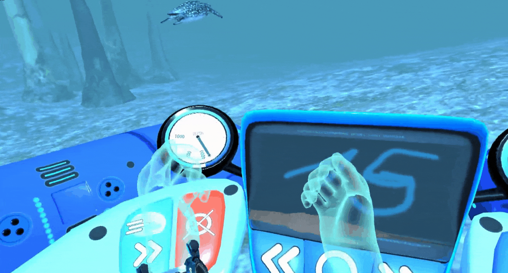

  

    
  

  

  

    
  

  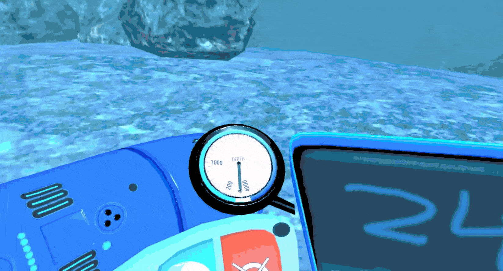

  

    
  

  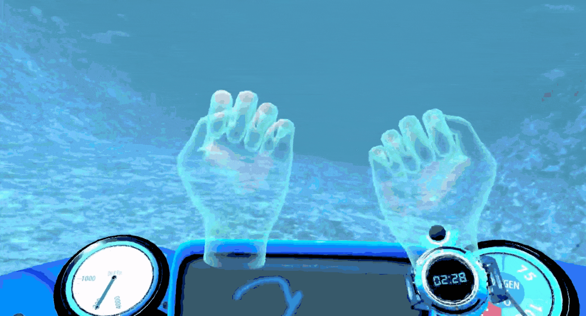

  

    
  

  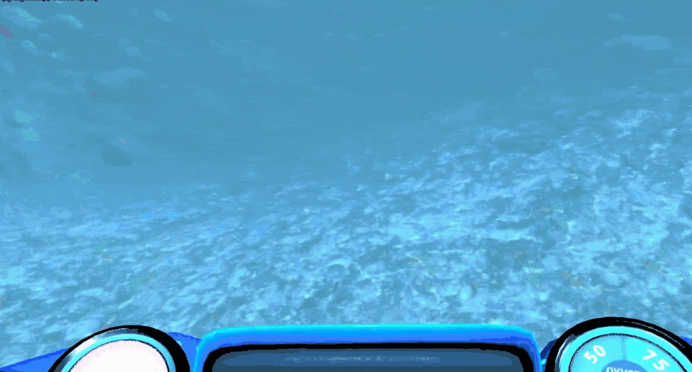

  

    
  

  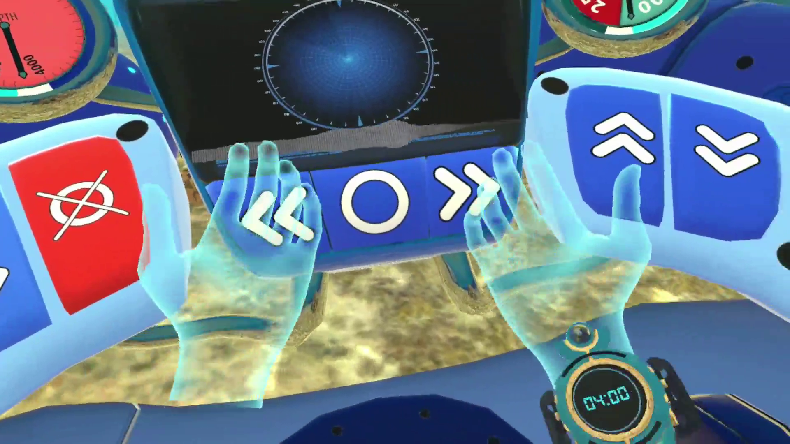

  

    
  

  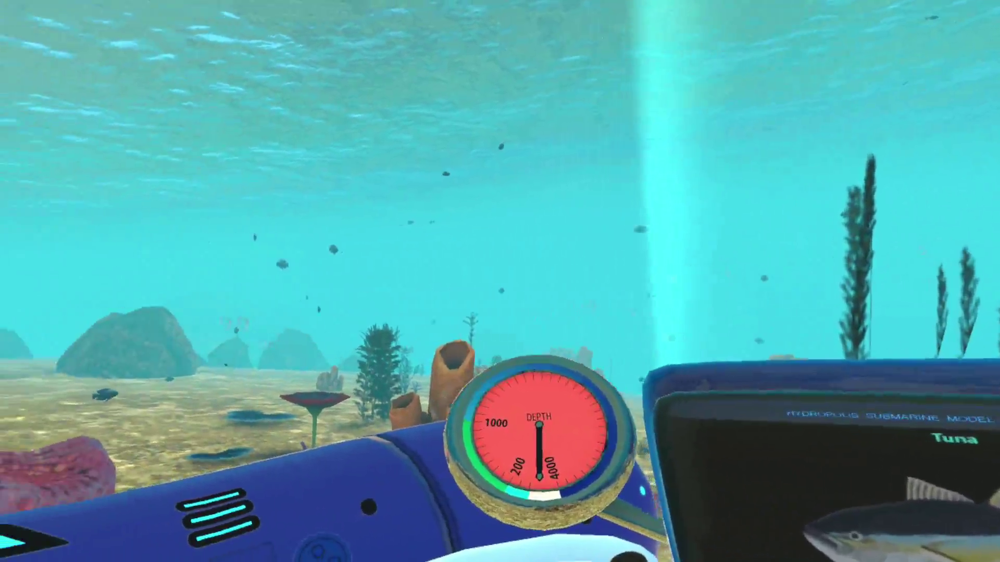

  

    
  

  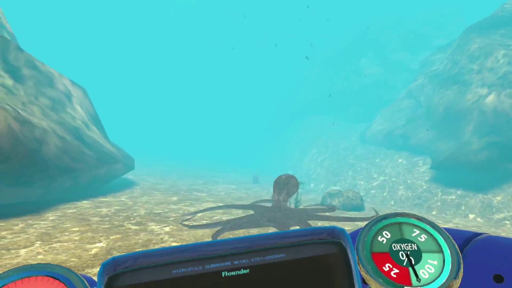

  

    
  

  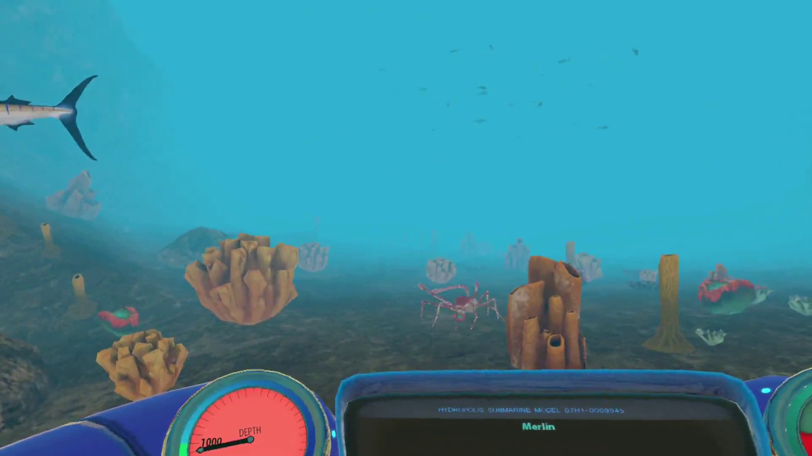

  

    
  

  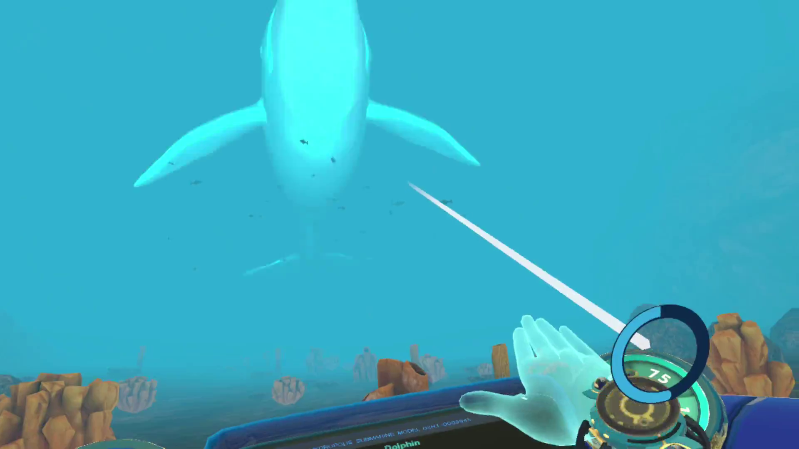

  

    
  

  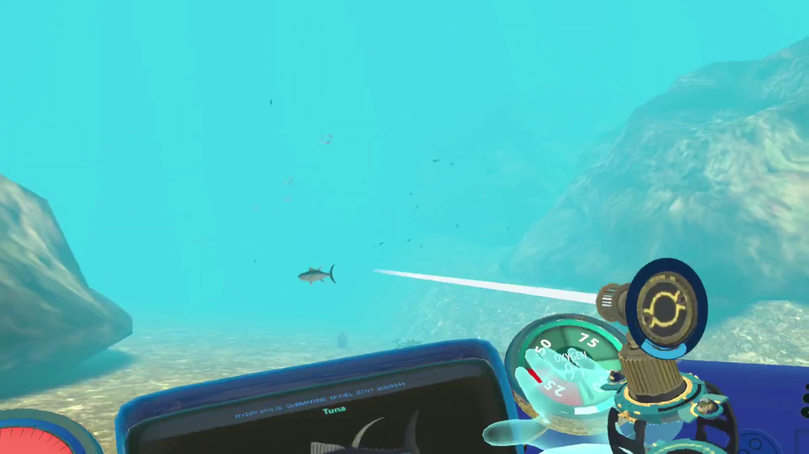

  

    
  

  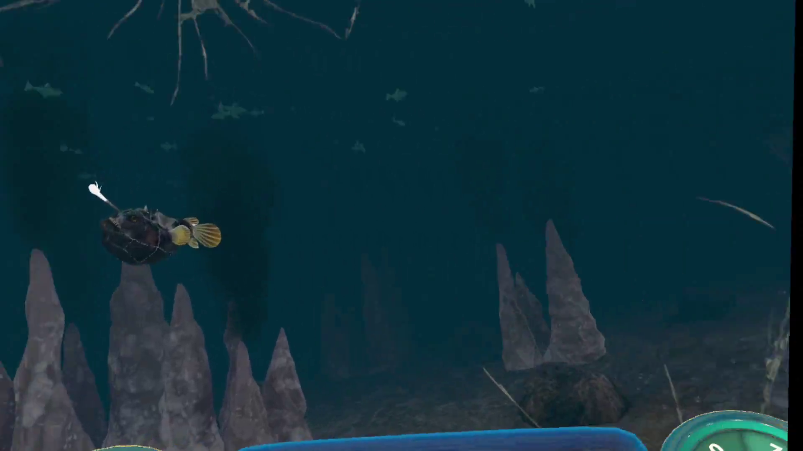

---

## Project Summary

| **Category**        | **Details**                                      |
|---------------------|--------------------------------------------------|
| **Platform**        | Virtual Reality (Standalone)                      |
| **Target Device**   | Meta Oculus Quest 2                               |
| **Interaction**     | Hand Tracking, Gesture-Based Controls, Spatial UI |
| **Engine**         | Unity (Real-Time 3D)                              |
| **Language**       | C#                                               |
| **XR Frameworks**  | OpenXR, Oculus Integration                       |
| **Graphics**       | Optimized Real-Time Rendering, Immersive Underwater Environments |
| **Version Control**| GitHub                                           |
| **Deployment**     | Android (Quest Platform)                         |

